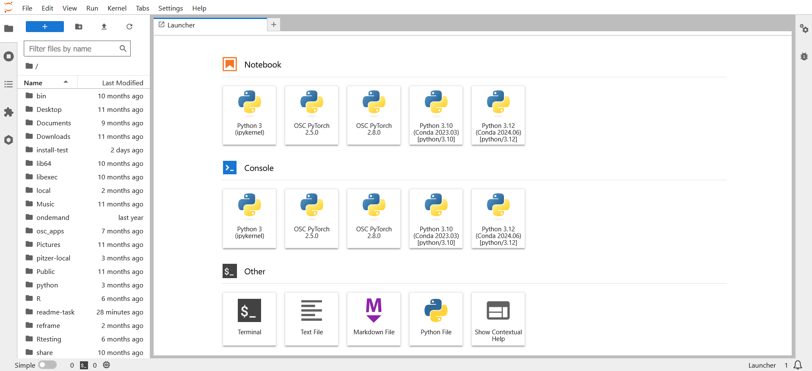

# Batch Connect - OSC Jupyter


[](https://opensource.org/licenses/MIT)

## Overview

An [Open OnDemand](https://openondemand.org/) Batch Connect app that launches a [Jupyter](https://jupyter.org/) server (Lab or Notebook) as an interactive session on OSC HPC clusters. Jupyter provides free, open-standard web services for interactive computing across multiple programming languages.

This app uses the Batch Connect `basic` template with Slurm and supports
clusters: Ascend, Pitzer, Cardinal, and Kubernetes.

- **Upstream project:** [Jupyter](https://jupyter.org/)
- **Batch Connect template:** `basic`
- **Scheduler:** Slurm, Kubernetes

## Screenshots



## Features

- Launches either Jupyter Lab or Jupyter Notebook (user-selectable radio button)
- Multi-cluster support (Ascend, Pitzer, Cardinal, Kubernetes)
- GPU-enabled node types with configurable CUDA versions
- Multiple Jupyter versions available via the `app_jupyter/` module
  (4.1.5, 3.1.18, 3.0.17, 2.3.2, 2.2.10, 1.2.21, 0.35.6)
- Configurable cores, wall time, and node type (standard, GPU, largemem,
  hugemem, debug) via the launch form
- Julia kernel support with user-managed IJulia environments
- Root directory selector for the Jupyter session
- Module-based software loading via Lmod (`project/ondemand`, `app_jupyter/`)

## Requirements

### Compute Node Software

This Batch Connect app requires the following software be installed on the
**compute nodes** that the batch job is intended to run on (**NOT** the
OnDemand node):

- [Lmod](https://www.tacc.utexas.edu/research-development/tacc-projects/lmod)
  6.0.1+ or any other `module purge` and `module load <modules>` based CLI
- [Jupyter](https://jupyter.org/) 4.2.3+ (earlier versions are untested but
  may work)
- [OpenSSL](https://www.openssl.org/) 1.0.1+ (used to hash the Jupyter
  server password)

### Open OnDemand

- Works on `2.0` onwards.
- Slurm scheduler
- Kubernetes scheduler

### Optional

- CUDA toolkit (for GPU-accelerated computing)
- Julia with IJulia package (for Julia kernel support)

## App Installation

### 1. Clone the repository

```sh
cd /var/www/ood/apps/sys
git clone https://github.com/OSC/bc_osc_jupyter.git
cd bc_osc_jupyter

# Pin to a release (recommended)
git checkout v0.32.1
```

No restart is needed -- Batch Connect apps are not Passenger apps and are
detected automatically.

### 2. Configure for your site

Edit `form.yml` and update these values for your cluster:

| Attribute          | OSC Default                          | Change to                        |
|--------------------|--------------------------------------|----------------------------------|
| `cluster`          | `ascend`, `pitzer`, `cardinal`, etc. | Your cluster name(s)             |
| `jupyter_version`  | `4.1.5` (and others)                 | Versions available on your system via `app_jupyter/` module |
| `node_type`        | OSC-specific node types              | Node types available on your cluster |
| `cuda_version`     | OSC CUDA modules                     | CUDA modules on your system (or remove if not needed) |
| `num_cores.max`    | `28`                                 | Max cores on your compute nodes  |

In `script.sh.erb`, the app loads modules with:
```
module load project/ondemand app_jupyter/<version>
```
Ensure equivalent modules are available on your system.

### 3. Update the app

```sh
cd /var/www/ood/apps/sys/bc_osc_jupyter
git fetch
git checkout <tag>
```

No restart is needed.

## Configuration

### form.yml attributes

| Attribute         | Widget          | Description                                           | Default          |
|-------------------|-----------------|-------------------------------------------------------|------------------|
| `cluster`         | select          | Target cluster ID(s)                                  | `ascend`, `pitzer`, `kubernetes`, `kubernetes-test`, `kubernetes-dev`, `cardinal` |
| `mode`            | radio           | Jupyter Lab (`1`) or Jupyter Notebook (`0`)            | `1` (Lab)        |
| `working_dir`     | path_selector   | Root directory for the Jupyter session                 | `$HOME`          |
| `bc_num_hours`    | number          | Maximum wall time (hours)                             | `1` |
| `node_type`       | select          | Compute node type (any, 40 core, 48 core, GPU, largemem, hugemem, debug) | `any` |
| `gpus`            | number_field    | Number of GPUs (0--4)                                  | `0`              |
| `cuda_version`    | select          | CUDA module to load for GPU computing                 | `none`           |
| `num_cores`       | number_field    | Number of CPU cores (1--28, varies by node type/cluster) | `1`           |
| `jupyter_version` | select          | Jupyter version to launch via `app_jupyter/` module    | `4.1.5`          |

## Using Julia Kernels

Using Julia modules at OSC depends on the user initializing the environment and having
IJulia for that particular version.

As an example, before this app will recognize the `julia/1.5.3` module as a valid
kernel choice, the user must have an existing v1.5 environment. The user
must also have added the `IJulia` package to that environment.

The easiest way to do this is:
* Get a terminal where the module is available and load it
* Start an interactive Julia session with the command `julia`
* Press `]` to activate pkg
* Type `activate` to be sure you're using the right environment
* Type `add IJulia` to add the IJulia package to this environment

## Troubleshooting

Always check the `/output` directory of the session data for the job. This can be accessed simply by clicking the 
session id within the session card itself. Within this directory the `output.log` will show you any output from the job 
as it was began and any logging you have introduced in the app's scripts from the `/template` directory files.

It can be incredibly helpful to introduce extra logging into your scripts as you troubleshoot to help diagnose connection issues.

**If running as a container**, you will need to make sure you are retrieving logs from the container itself if it is having trouble 
running, which again, you can introduce when you call the container in your `script.sh.erb`.

## Testing

Manual currently.

## Deployments

If your site would like to add your name to our known deployments, please let us know!

| Site                      | OOD Version    | Scheduler | Status     |
|---------------------------|----------------|-----------|------------|
| Ohio Supercomputer Center | 4.1.4 | Slurm/K8s     | Production |

## Known Limitations

- Julia kernel support requires users to manually set up IJulia environments
  (see [Using Julia Kernels](#using-julia-kernels) above)
- CUDA version availability varies by cluster and node type

## Contributing

1. Fork it ( https://github.com/OSC/bc_osc_jupyter/fork )
2. Create your feature branch (`git checkout -b my-new-feature`)
3. Commit your changes (`git commit -am 'Add some feature'`)
4. Push to the branch (`git push origin my-new-feature`)
5. Create a new Pull Request

For bugs or feature requests,
[open an issue](https://github.com/OSC/bc_osc_jupyter/issues).

## References

- [Jupyter](https://jupyter.org/) -- the application launched by this app
- [Open OnDemand](https://openondemand.org/) -- the HPC portal framework
- [OOD Batch Connect app development docs](https://osc.github.io/ood-documentation/latest/app-development.html)
- [Changelog](https://github.com/OSC/bc_osc_jupyter/blob/master/CHANGELOG.md)
  -- release history for this app

## License

* Documentation, website content, and logo is licensed under
  [CC-BY-4.0](https://creativecommons.org/licenses/by/4.0/)
* Code is licensed under MIT (see LICENSE.txt)
* The Jupyter logo is a trademark of NumFOCUS foundation.

## Acknowledgments

This app is built on [Open OnDemand](https://openondemand.org/), developed and
maintained by the [Ohio Supercomputer Center (OSC)](https://www.osc.edu/).

Open OnDemand is supported by the National Science Foundation under awards
[NSF SI2-SSE-1534949](https://www.nsf.gov/awardsearch/showAward?AWD_ID=1534949)
and [NSF CSSI-Frameworks-1835725](https://www.nsf.gov/awardsearch/showAward?AWD_ID=1835725).
